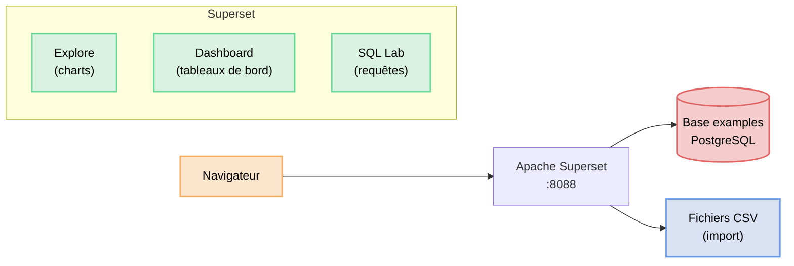

# Installation d'Apache Superset

Prometheus et Grafana permettent de surveiller des systèmes en temps réel. Apache Superset répond à un besoin différent : **explorer et visualiser des données structurées** — fichiers CSV, bases de données, entrepôts de données. C'est l'outil open source de référence pour créer des dashboards analytiques à partir de données métier.

## Comprendre Superset

Superset est une application web qui se connecte à des sources de données pour permettre l'exploration visuelle sans écrire de code. Il embarque un éditeur SQL, un explorateur de graphiques et un constructeur de dashboards.



| Composant | Rôle |
|-----------|------|
| **Explore** | Créer et configurer des graphiques à partir d'un dataset |
| **Dashboard** | Assembler plusieurs graphiques en une vue cohérente |
| **SQL Lab** | Écrire des requêtes SQL directement sur les sources |
| **Datasets** | Référencer les tables comme sources de données |

## Prérequis

Vous allez installer Superset sur votre machine.
Il vous faut Docker et Git installés.

## Installation

La procédure officielle est documentée ici :  
👉 https://superset.apache.org/user-docs/quickstart

### 1. Cloner le dépôt

```bash
git clone https://github.com/apache/superset
cd superset
```

### 2. Choisir la version

```bash
git checkout tags/6.0.0
```

### 3. Lancer la stack

```bash
docker compose -f docker-compose-image-tag.yml up
```

👉 Docker télécharge les images et charge des données d'exemple. Ce premier démarrage peut prendre plusieurs minutes.

## Vérifier le fonctionnement

Une fois les conteneurs démarrés, ouvrez votre navigateur :

👉 http://localhost:8088

Connectez-vous avec :
- Utilisateur : `admin`
- Mot de passe : `admin`

Vous devez voir l'interface principale de Superset avec les menus **Charts**, **Dashboards** et **Datasets**.

Pour arrêter la stack :

```bash
docker compose down
```

## Activer l'import de fichiers CSV

Par défaut, Superset n'autorise pas l'upload de fichiers vers la base de données. Il faut activer cette option manuellement.

### 1. Accéder aux connexions de base de données

Dans le menu en haut à droite :  
👉 **Settings → Database Connections**

### 2. Modifier la base "examples"

Cliquez sur la ligne **examples**, puis sur l'icône crayon **Edit**.

### 3. Activer l'upload

Dans la fenêtre d'édition :

- Cliquez sur **Advanced**
- Déroulez la section **Security**
- Cochez **Allow file uploads to database**
- Cliquez sur **Finish**

## Importer le fichier CSV

Le fichier de données se trouve dans le dossier `data/` de cette activité : `emissions_co2_secteurs.csv`.

### 1. Lancer l'import

Dans le menu en haut à droite :  
👉 **Settings → Upload CSV to database** (ou via le menu **+**)

### 2. Sélectionner le fichier

Cliquez sur **Select** et choisissez le fichier `emissions_co2_secteurs.csv` depuis votre machine.

### 3. Configurer l'import

Remplissez les champs suivants :

| Champ | Valeur |
|-------|--------|
| Database | `examples` |
| Schema | `public` |
| Table Name | `co2_emissions` |
| Delimiter | `,` |

### 4. Lancer l'upload

Cliquez sur **Upload**.

👉 Superset crée automatiquement la table `co2_emissions` dans la base `examples` et la référence comme dataset utilisable dans Explore.

## Vérifier le dataset

Dans le menu :  
👉 **Datasets**

Vous devez voir `co2_emissions` dans la liste.

## Comprendre les données

Le fichier `emissions_co2_secteurs.csv` contient des données fictives représentant l'évolution annuelle de 4 secteurs économiques suisses entre 2015 et 2024.

| Colonne | Description |
|---------|-------------|
| `Annee` | Année (2015 à 2024) |
| `Secteur` | IT, Industrie, Commerce ou Services |
| `Emissions_CO2_tonnes` | Emissions totales du secteur en tonnes de CO2 |
| `Part_renouvelable_pct` | Pourcentage d'énergie renouvelable utilisée |
| `Nb_employes` | Nombre d'employés dans le secteur |
| `CA_MCHF` | Chiffre d'affaires en millions de francs suisses |

## Résultat

Superset est installé et le dataset est importé. Vous pouvez maintenant :
- créer des graphiques avec l'outil Explore
- assembler des dashboards
- exécuter des requêtes SQL dans SQL Lab
