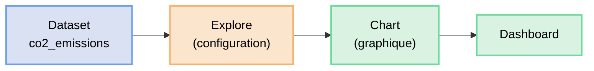

# Premiers graphiques avec Superset

Superset est installé et connecté à votre Google Sheet. L'objectif de cette partie est de créer vos premiers graphiques et de les assembler dans un dashboard.

## L'interface Explore

Superset propose un outil central pour créer des graphiques : **Explore**. Il fonctionne sans écrire de code : vous sélectionnez un dataset, un type de graphique, et vous configurez les dimensions et métriques visuellement.



### Vocabulaire Superset

| Terme | Signification |
|-------|---------------|
| **Dataset** | La source de données (table ou CSV) |
| **Metric** | Ce que vous mesurez (somme, moyenne, comptage…) |
| **Dimension** | Ce par quoi vous regroupez (secteur, année…) |
| **Filter** | Condition pour restreindre les données affichées |
| **Chart** | Un graphique sauvegardé |
| **Dashboard** | Un ensemble de charts assemblés |

## Accéder à Explore

Dans le menu de gauche :  
👉 **Charts → + Chart**

Sélectionnez le dataset `co2_emissions`, puis choisissez un type de visualisation.

## Graphique 1 — Evolution des émissions par secteur

**Type de visualisation :** Line Chart

Dans la configuration du graphique :

| Champ | Valeur |
|-------|--------|
| X-Axis | `Annee` |
| Metric | `SUM(Emissions_CO2_tonnes)` |
| Dimension | `Secteur` |

Cliquez sur **Update Chart**.

Sauvegardez le graphique :  
👉 Bouton **Save** → Nom : `Emissions CO2 par secteur (2015-2024)`

**Réponse — Quel secteur domine largement en termes d'émissions absolues ?**

    (votre réponse ici)

**Réponse — Quel secteur a la croissance la plus forte sur la période ?**

    (votre réponse ici)

---

## Graphique 2 — Comparaison des émissions en 2024

**Type de visualisation :** Bar Chart

| Champ | Valeur |
|-------|--------|
| X-Axis | `Secteur` |
| Metric | `SUM(Emissions_CO2_tonnes)` |
| Filters | `Annee = 2024` |

Sauvegardez : `Emissions CO2 par secteur en 2024`

**Réponse — L'Industrie émet combien de fois plus que le secteur IT en 2024 ?**

    (votre réponse ici)

---

## Graphique 3 — Part des énergies renouvelables

**Type de visualisation :** Line Chart

| Champ | Valeur |
|-------|--------|
| X-Axis | `Annee` |
| Metric | `AVG(Part_renouvelable_pct)` |
| Dimension | `Secteur` |

Sauvegardez : `Part renouvelable par secteur`

**Réponse — Quel secteur adopte le plus rapidement les énergies renouvelables ?**

    (votre réponse ici)

---

## Graphique 4 — Nombre d'employés par secteur

**Type de visualisation :** Bar Chart (empilé)

| Champ | Valeur |
|-------|--------|
| X-Axis | `Annee` |
| Metric | `SUM(Nb_employes)` |
| Dimension | `Secteur` |
| Bar Stack | activé |

Sauvegardez : `Emplois par secteur`

**Réponse — Quel secteur emploie le plus de personnes en 2024 ?**

    (votre réponse ici)

---

## Graphique 5 — Tableau récapitulatif 2024

**Type de visualisation :** Table

| Champ | Valeur |
|-------|--------|
| Columns | `Secteur` |
| Metrics | `SUM(Emissions_CO2_tonnes)`, `AVG(Part_renouvelable_pct)`, `SUM(Nb_employes)`, `SUM(CA_MCHF)` |
| Filters | `Annee = 2024` |
| Row Limit | 10 |

Sauvegardez : `Tableau récapitulatif 2024`

---

## Utiliser SQL Lab

Superset intègre un éditeur SQL qui permet d'aller plus loin que l'interface visuelle. Cela est utile pour créer des métriques calculées.

Dans le menu :  
👉 **SQL Lab → SQL Editor**

Sélectionnez la base de données `main`.

### Requête 1 — Emissions par employé

```sql
SELECT
    "Annee",
    "Secteur",
    "Emissions_CO2_tonnes",
    "Nb_employes",
    ROUND((CAST("Emissions_CO2_tonnes" AS NUMERIC) / "Nb_employes"), 2) AS emissions_par_employe
FROM public.co2_emissions
ORDER BY "Annee", "Secteur";
```

Exécutez la requête et observez les résultats.

**Réponse — Quel secteur a les émissions les plus élevées par employé en 2024 ?**

    (votre réponse ici)

### Requête 2 — Emissions par million de CHF de CA

```sql
SELECT
    "Annee",
    "Secteur",
    ROUND(CAST("Emissions_CO2_tonnes" AS NUMERIC) / "CA_MCHF", 2) AS emissions_par_MCHF
FROM public.co2_emissions
WHERE "Annee" = 2024
ORDER BY emissions_par_MCHF DESC;
```

**Réponse — Le classement des secteurs change-t-il selon la métrique utilisée (absolu, par employé, par MCHF de CA) ?**

    (votre réponse ici)

---

## Créer un Dashboard

Un dashboard regroupe plusieurs graphiques pour raconter une histoire cohérente.

### 1. Créer un nouveau dashboard

Dans le menu :  
👉 **Dashboards → + Dashboard**

Donnez-lui le nom : `Analyse Emissions CO2 Suisse`

### 2. Ajouter les graphiques

Cliquez sur **Edit dashboard**, puis faites glisser vos graphiques depuis le panneau de droite vers la zone centrale :

1. `Emissions CO2 par secteur (2015-2024)` — ligne du dessus, pleine largeur
2. `Emissions CO2 par secteur en 2024` et `Part renouvelable par secteur` — côte à côte
3. `Emplois par secteur` — dessous
4. `Tableau récapitulatif 2024` — en bas

### 3. Ajouter un filtre global

Cliquez sur **Filters** puis **+ Add/Edit Filters** :

| Champ | Valeur |
|-------|--------|
| Filter type | `Value` |
| Dataset | `emissions_co2_secteurs` |
| Column | `Secteur` |
| Default value | (vide = tout afficher) |
| Filter label | `Filtrer par secteur` |

Ce filtre permet de cliquer sur un secteur et de mettre à jour tous les graphiques simultanément.

### 4. Sauvegarder

Cliquez sur **Save** puis **Save and go to dashboard**.

**Réponse — En filtrant uniquement le secteur IT, quelle tendance ressort clairement ?**

    (votre réponse ici)

---

## Résultat

Vous savez maintenant :
- créer différents types de graphiques avec Explore
- écrire des requêtes SQL dans SQL Lab
- assembler un dashboard interactif avec filtres

Dans la partie suivante, vous allez utiliser ces mêmes données pour créer des graphiques qui racontent des histoires contradictoires — et comprendre pourquoi les statistiques peuvent induire en erreur.
